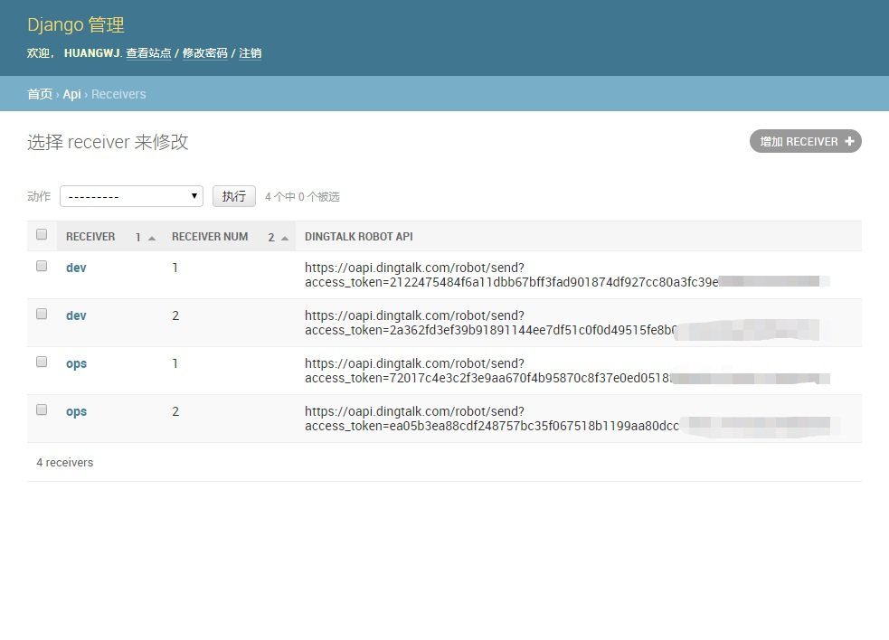
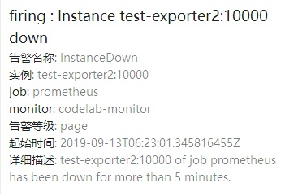
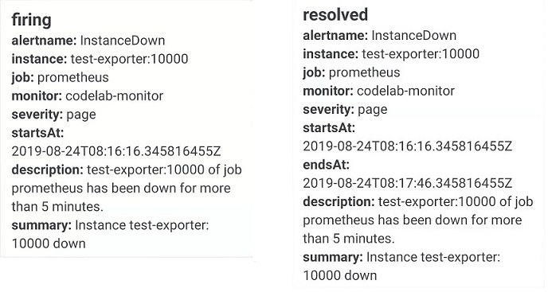

# 基于django的alertmanager钉钉告警及告警记录


基于django实现的alertmanager钉钉告警消息推送，同时记录推送的告警内容，包括告警名，实例，时间，次数，接收人等等  

可以按照自定义模板推送告警信息

告警消息记录在mysql中，通过grafana查询mysql显示不同规则下TOP10的告警，当前未解除告警，以及最近100条告警记录  

告警中只存储了通用字段，自定义的labels如果需要保存请自行修改`api/modules.py`

单receiver可对应多个钉钉机器人，用来解决钉钉API每分钟请求限制20次

目前还处于学习阶段，实现的比较粗糙，也没有做异常处理，有问题请在issue中指出

## release note

### v0.1.1  
新增告警模板支持

### v0.1  
实现基本功能

## 开发环境

```
python 3.7.3
django 2.1.8
mysql 5.7.27
alertmanager v0.18.0
prometheus v2.11.2
```

## 结构说明

```
dingding_robot_alertmanager/
├── api
│   ├── admin.py	# admin
│   ├── apps.py
│   ├── dingtalk.py	#钉钉函数
│   ├── __init__.py
│   ├── models.py	# 数据库初始化
│   ├── templates
│   ├── test	# 测试内容，无意义
│   │   ├── 000alert.py
│   │   ├── alert-msg.json	# alert json
│   │   ├── post_firing.py	# alertmanager post firing
│   │   ├── post_resolved.py	# alertmanager post resolved
│   │   ├── test_prometheus.yaml	# k8s配置文件，prometheus alertmanager 及config
│   │   └── time_reverse.py		# 时间转换，无意义
│   ├── tests.py
│   └── views.py	# api逻辑
├── dingding_robot_alertmanager
│   ├── __init__.py
│   ├── settings.py		# django配置文件
│   ├── urls.py
│   └── wsgi.py
├── grafana-dashboard	# grafana dashboard
│   └── alert-1566911356524.json
├── images	# 图片
│   ├── admin-index.bmp
│   ├── admin-receivers.bmp
│   ├── alert.bmp
│   └── grafana.bmp
├── msg-templates   # 告警模板文件
│   ├── firing-msg-template.md  # firing模板
│   └── resolved-msg-template.md    # resolved模板
├── manage.py
├── README.md
└── requirements.txt	# pip依赖
```


## 部署

安装Python3，并安装依赖包

```
pip3 install -r requirements.txt
```

mysql创建数据库

```
create database prometheus_alert default charset utf8;
```

mysql建表

```
python3 manage.py makemigrations api
python manage.py migrate
```

创建django admin后台管理员账号

```shell
python3 manage.py createsuperuser
```

启动应用

```shell
python3 manage.py runserver 0.0.0.0:8000
```

**django admin后台** http://localhost:8000/admin


在后台receivers中添加钉钉机器人，同一receiver可以添加多个webhook，用receiver_num进行区分和标记



alertmanager中添加receiver和route

example.yml

```yaml
global:
templates: 
- '/etc/alertmanager/template/*.tmpl'
route:
  group_by: ['alertname','job']
  group_wait: 30s
  group_interval: 15s
  repeat_interval: 1m
  receiver: 'ops'
  routes:
  - match:
      job: 'prometheus'
    receiver: 'dev'
    
receivers:
- name: 'dev'
  webhook_configs:
  - send_resolved: true
    url: 'http://192.168.0.3:8000'
- name: 'ops'
  webhook_configs:
  - send_resolved: true
    url: 'http://192.168.0.3:8000'
```

最后，安装grafana并导入dashboard`grafana-dashboard/alert-1566911356524.json`，添加mysql数据源

```shell
rpm -ivh https://dl.grafana.com/oss/release/grafana-6.3.3-1.x86_64.rpm
```


## 自定义告警模板

```
├── msg-templates   # 告警模板文件
│   ├── firing-msg-template.md  # firing模板
│   └── resolved-msg-template.md    # resolved模板
```
msg-templates中定义了两个Markdown格式的template，分别对应firing和resolved告警信息。需要传递自定义label请按照如下格式进行传递:  
`{$var}`  

演示模板如下:
```markdown
## {$status} : {$summary}  
**告警名称**: {$alertname}  
**实例**: {$instance}  
**job**: {$job}  
**monitor**: {$monitor}  
**告警等级**: {$severity}  
**起始时间**: {$startsAt}  
**详细描述**: {$description}  
```  
格式化告警效果如下:   


如果模板中定义了告警信息中不包含的labels，则不会匹配告警模板，按照非格式化模板推送告警信息  

非格式化告警效果如下:


如果收到上述告警，请查看alertmanager，并检查模板中定义的labels是否在监控job或告警信息中体现  

### 关于模板中的变量字段说明
默认字段为alertmanager官方字段  

|字段|说明|  
|:-:|:-:|  
|status|默认字段，状态，firing或resolved|  
|alertname|默认字段，alert rule中的rule字段|  
|instance|默认字段，告警的instance|   
|job|默认字段，prometheus.yml中的target job|  
|monitor|默认字段，prometheus.yml中的monitor|  
|description|默认字段，rule中的description|  
|summary|默认字段，rule中的description|  
|startsAt|默认字段，告警开始时间|  
|endsAt|默认字段，告警结束时间|  
|generatorURL|默认字段，告警详情url|  
|severity|自定义字段，prometueus.rules中自定义label|  
